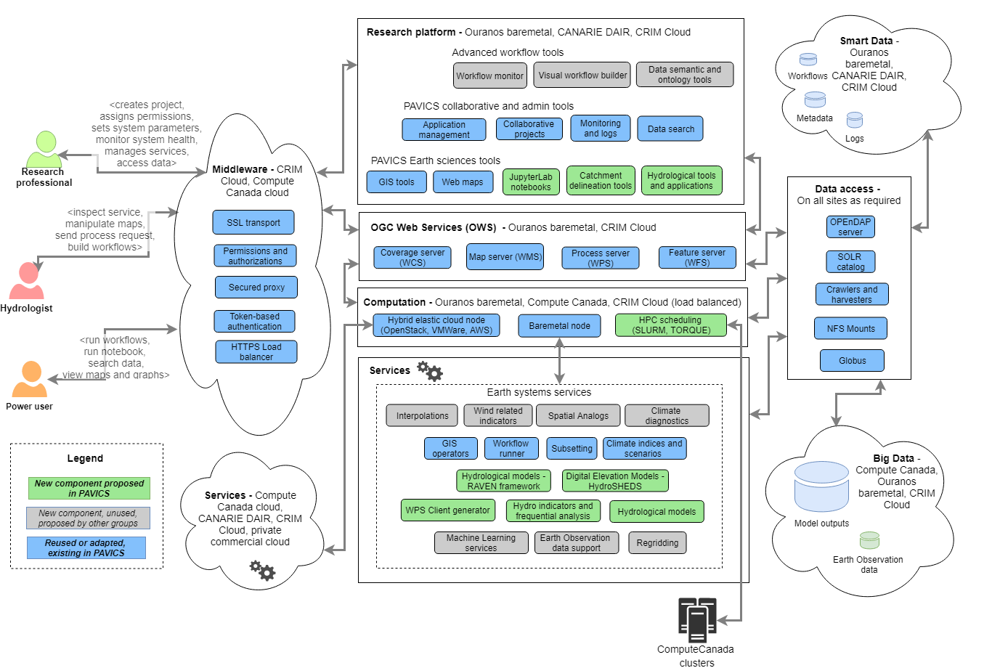

=====================
Backend - PAVICS Node
=====================

PAVICS nodes are data, compute and index endpoints accessed through the PAVICS platform or external clients. The Node service is the backend that provides data storage, metadata harvesting, indexation and discovery of local and federated data, user authentication and authorization, server registration and management. The *node service* is therefore composed of several services that are briefly described below, accompanied by links to the full documentation of each individual building block.

The backend of PAVICS-SDI is built entirely with Free and Open Source Software. All of the backend projects (source code and documentation) are open to be inspected, built upon, or contributed to.

Data storage
------------

Data is stored on two different servers: THREDDS for gridded netCDF data, and GeoServer for GIS features (region polygons, river networks).

THREDDS
    The *Thematic Real-time Environmental Distributed Data Services* (`THREDDS`_) is a server system for providing scientific data and metadata access through various online protocols. The PAVICS platform relies on THREDDS to provide access to all netCDF data archives, as well as output files created by processes. The code is hosted on this `GitHub repository <https://github.com/Unidata/thredds>`_. THREDDS support direct file access as well as the OPeNDAP protocol, which allows the netCDF library to access segments of the hosted data without downloading the entire file. Links to files archived on THREDDS are thus used as inputs to WPS processes.

GeoServer
    `GeoServer`_ is an OGC compliant server system built for viewing, editing, and presenting geospatial data. PAVICS uses GeoServer as its database for vector geospatial information, such as administrative regions, watersheds and river networks. The frontend sends requests for layers that can be overlayed on the map canvas. See the `GeoServer documentation <http://docs.geoserver.org/>`_ for more information on its capabilities.

Data Catalog
------------

Although information about file content is stored in the netCDF metadata fields, accessing and reading those fields one by one takes a considerable amount of time. To improve file discoverability, we manage [intake-esm](https://github.com/intake/intake-esm) catalogs for each data category found within the dataset folder of THREDDS:

- biasadjusted
- climex
- cmip5
- forecast
- gridobs
- reanalysis
- stationobs

These catalogs are created by:

- walking through all the aggregated datasets found in the THREDDS ``Datasets`` folder;
- calling THREDDS NCML service on each dataset. This returns an XML file storing metadata;
- parsing the NCML metadata and creating a catalog description (``json``) and a data table (``csv``).

The resulting catalogs are hosted at https://pavics.ouranos.ca/catalog

Climate Analytic Processes with Birdhouse
-----------------------------------------

The climate computing aspect of PAVICS is largely built upon the many components developed as part of the `Birdhouse Project <https://github.com/bird-house/birdhouse-docs/blob/master/slides/birdhouse-architecture/birdhouse-architecture.pdf>`_. The goal of Birdhouse is to develop a collection of easy-to-use Web Processing Service (WPS) servers providing climate analytic algorithms. Birdhouse servers are called 'birds', each one offering a set of individual processes:

Birdhouse/Finch
    Provides access to a large suite of climate indicators, largely inspired by `ICCLIM`_.
    `Finch Official Documentation <https://finch.readthedocs.io/en/latest/>`_ Finch also includes processes to subset and average gridded data over bounding boxes or polygons.

Raven
    Provides hydrological modeling capability using the `Raven`_ framework, along with model calibration utilities, regionalization tools, and watershed properties extraction tools.

Birdhouse/Malleefowl
    Provides processes to access ESGF data nodes and THREDDS catalogs, as well as a workflow engine to string different processes together.
    `Malleefowl Official Documentation <https://malleefowl.readthedocs.io/en/latest/>`_

Birdhouse/Flyingpigeon
    Provides a wide array of climate services including indices computation, spatial analogs, weather analogs, species distribution model, subsetting and averaging, climate fact sheets, etc. FlyingPigeon is the sand box for emerging services, which eventually will make their way to more stable and specialized birds.
    `Flyingpigeon Official Documentation <https://flyingpigeon.readthedocs.io/en/latest/>`_

Birdhouse/Hummingbird
    Provides access to climate Data Operators (`CDO`_) functions and compliance-checker for netCDF files.
    `Hummingbird Official Documentation <https://birdhouse-hummingbird.readthedocs.io/en/latest/>`_

Virtually all individual processes ingest and return netCDF files (or OPeNDAP links for some processes), such that one process' output can be used as the input of another process. This lets scientist create complex workflows. By insisting that process inputs and outputs comply with the CF-Convention, we make sure that data is accompanied by clear and unambiguous metadata.

Authentication and authorization
--------------------------------

Access to files and services is controlled by a security proxy called `Twitcher`_, also part of Birdhouse. Upon login, the proxy issues access tokens that allow users to access services behind the proxy. CRIM developed a Twitcher extension called `Magpie`_ that provides a higher level of granularity for service access.

Twitcher
  Proxy service issuing access tokens necessary to run WPS processes or any other OWS service.

Magpie
  Manages user/group/resource permissions for services behind Twitcher.

Gridded data visualization
--------------------------
The PAVICS platform is not meant as a front-end, but still provides backend services to facilitate data visualization. It provides for each netCDF file in the THREDDS server a WMS endpoint that can be used to display netCDF fields over maps.

.. _CDO: https://code.mpimet.mpg.de/projects/cdo/

.. _`THREDDS`: https://www.unidata.ucar.edu/software/thredds/current/tds/

.. _`GeoServer`: http://geoserver.org/about/

.. _`Twitcher`: https://twitcher.readthedocs.io/en/latest/

.. _`Magpie`: https://github.com/Ouranosinc/Magpie

.. _`Raven`: http://raven.uwaterloo.ca/

.. _`ICCLIM`: https://icclim.readthedocs.io/en/latest/
