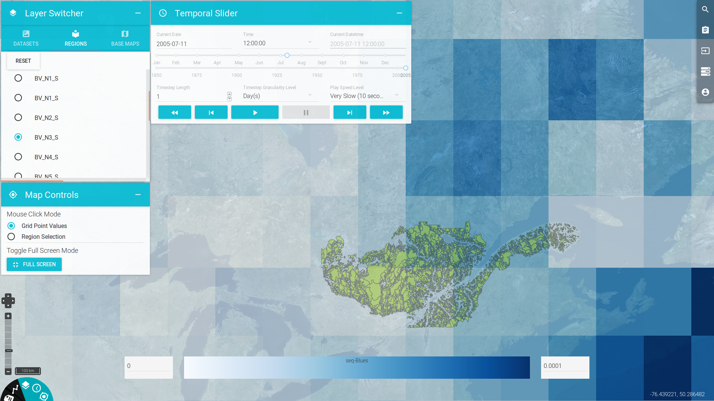

========
Frontend
========

Justification
-------------

The PAVICS-frontend (`GitHub Repository <https://github.com/Ouranosinc/PAVICS-frontend>`_) is the main interface for users to perform analyses such as:

* Creation of standard and custom climate change scenarios for impact and adaptation studies, 

* Spatial and temporal exploration of climate data sets, 

* Analysis and validation of climate model simulations, and 

* Visualization of climate change scenarios at the watershed scale. 

These tasks conventionally require downloading terabytes of data and heavy data processing that convert raw data into useful products: statistics, graphics, time series, or maps. PAVICS-frontend turns these time-consuming tasks into a streamlined click, drag and drop exercise. Over 20 collaborators have pledged their support to this vision of an hardware and software interface that gives both experienced researchers and non-specialists access to a highly advanced and powerful toolset.

Example
~~~~~~~

For an example of a climate analysis process using the PAVICS-frontend, see this short :download:`hands-on video <images/PAVICS_process.mp4>`.

Elements
--------

Panels
~~~~~~
Panels provide methods for interacting with any preconfigured or calculated data sets within the PAVICS-SDI. The bottom-left corner of PAVICS-frontend toggles visibility for five different panels:

* Clicked Point Information,
* A Time Series Chart,
* A Data Layer Visibility Switcher,
* A Temporal Slider, and
* Other Map Controls

Each panel element can be used to view/inspect different types and display additional information of the active data.

Data and Process Manager
~~~~~~~~~~~~~~~~~~~~~~~~

  

.. todo::

   Write frontend docs.
