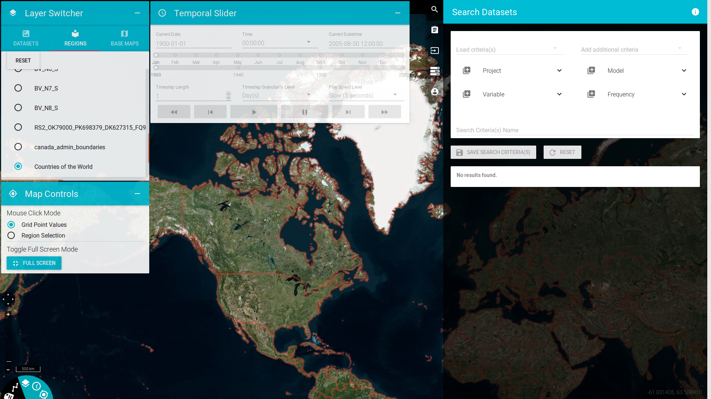

Overview
========

PAVICS is a Spatial Data Infrastructure (SDI) for climate data. It is composed of modular components that together provide access to data and a library of climate services. It is meant to facilitate climate data analysis for both researchers and climate service providers. PAVICS is not intended to be installed on individual computers, but rather on servers located close to data archives.

There are multiple building blocks composing the PAVICS SDI:

Birdhouse
   Web Processing Services (WPS) supporting data processing in the climate science community. It includes multiple sub-components:

   Birdhouse/Finch
      A library of climate indicators.

   Birdhouse/Flyingpigeon
      Climate services including indices computation, spatial analogs, weather analogs, species distribution model, subsetting and averaging, climate fact sheets, etc.

   Birdhouse/Malleefowl
      Access to ESGF data nodes and THREDDS catalogs, workflow engine.

   Birdhouse/Hummingbird
      Climate Data Operators (CDO) and compliance-checker for netCDF files.

Raven
  A WPS server for hydrological modeling, calibration, regionalization of ungauged basins and time series analysis.

JupyterLab
  A notebook interface to demonstrate how WPS services can be used from a programming environment.

PAVICS-frontend
   The user interface (UI) handling user accounts, workspace, workflows and data visualization. Development of the UI has paused as it consumed a lot of resources, consider it as a prototype.

PAVICS-DataCatalog
   Storing and serving information about available climate data.

Magpie
   Authentication and authorization services.

THREDDS
   netCDF data server.

GeoServer
   Geospatial data server.

These components work together to offer users a seamless access to data and a suite of services that can convert raw climate data into useful information, graphics and tables.

Credits
-------
PAVICS is led by `Ouranos <https://www.ouranos.ca/en/>`_, a regional climatology research consortium, and `CRIM <http://www.crim.ca/fr>`_, an informatics and software research institute, (both located in Montreal, Quebec, Canada) to provide climate scientists with a set of tools to acquire and analyze climate data. The project was initially funded by the CANARIE research software program, and has since benefited from contributions from the Open Geospatial Consortium, the Québec Ministry of Environment and Fight Against Climate Change, Environment and Climate Change Canada and the Canadian Foundation for Innovation.
